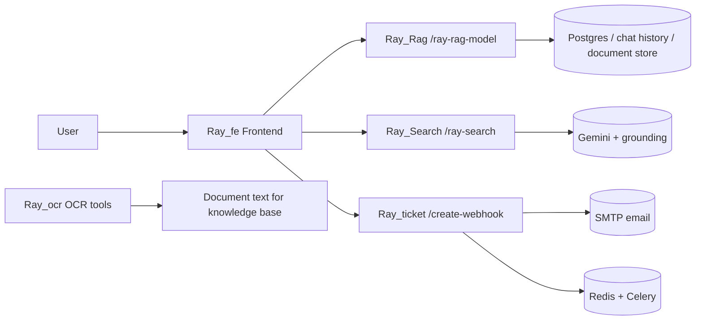

# Super Ray Monorepo

Super Ray is a multi-project workspace that combines a Next.js frontend, several FastAPI backends, an OCR utility, and a ticketing service. The folders in this repository are independent projects that work together as one product suite:

- `Ray_fe` - the main web frontend for chat, dashboards, administration, and auth flows
- `Ray_Rag` - a retrieval-augmented generation backend for knowledge-base answers
- `Ray_Search` - a grounded search/chat backend with throttling and response caching
- `Ray_ocr` - OCR tooling for extracting text from images and PDFs
- `Ray_ticket/super_ray_ticketing` - the AI-powered internal ticketing backend

The overall flow is simple:



## What Each Folder Does

### Ray_fe

`Ray_fe` is the browser app built with Next.js, React, Tailwind, and a large component library. It is the user-facing shell for the whole system.

Main functionality:

- Chat interface for employee questions and role-based routing
- Landing, sign-up, OTP, and login flow before the main app opens
- Dashboard screens for executive, admin, operations, knowledge base, alerts, audit logs, and Ray Desk views
- Command palette and sidebar navigation for fast switching between tools
- Frontend API routes that proxy requests to the backend services

Important files and behavior:

- `app/page.tsx` controls the pre-auth flow and the main tabbed application shell
- `app/api/chat/route.ts` routes chat requests to different backends depending on role and command
- `app/api/auth/send-otp/route.ts`, `verify-otp`, and `resend-otp` handle OTP-based login flows
- `components/` contains the dashboard pages, chat UI, navigation, auth forms, and reusable design-system widgets
- `lib/` contains auth data, ticket/chat types, email helpers, sample data, and utility functions

How it behaves:

- Employee chat can be sent to `Ray_Rag` or `Ray_Search`
- Ticket creation flows are forwarded to `Ray_ticket`
- The app stores session and login state in browser storage for smoother re-entry

Run it locally:

```bash
cd Ray_fe
pnpm install
pnpm dev
```

### Ray_Rag

`Ray_Rag` is the knowledge-answer backend. It exposes a FastAPI endpoint that uses Gemini, embeddings, RAG search, document retrieval, and SQL queries against structured document rows.

Main functionality:

- Accepts chat requests at `POST /ray-rag-model`
- Loads previous session messages from the database
- Calls a Gemini-based agent that performs RAG search first
- Falls back to document metadata, file contents, or SQL over row data when needed
- Returns the final answer together with sources

Important files and behavior:

- `app/main.py` is the FastAPI entrypoint and request handler
- `app/services/agent.py` coordinates the tool loop and answer generation
- `app/services/llm.py` configures Gemini and Cohere clients
- `app/tools/` contains the document, RAG, and SQL helpers used by the agent
- `app/memory.py` stores and loads chat history
- `app/db.py` initializes the database pool and schema access

What this backend is for:

- Answering employee questions from a document knowledge base
- Producing grounded responses with document sources
- Handling more structured questions by querying tabular document data instead of guessing

Run it locally:

```bash
cd Ray_Rag
pip install -r requirements.txt
uvicorn app.main:app --host 0.0.0.0 --port 8000
```

### Ray_Search

`Ray_Search` is a FastAPI search/webhook service with a built-in browser UI. It is optimized for grounded Gemini answers, request deduplication, caching, and rate-limit handling.

Main functionality:

- Serves a small HTML UI at `GET /`
- Accepts requests at `POST /ray-search`
- Uses per-session rate limiting and in-flight request deduplication
- Caches recent responses for a short time
- Falls back gracefully when Gemini returns upstream 429 errors
- Returns `reply`, `sources`, `confidence`, and the raw response payload

Important files and behavior:

- `app/main.py` is the server entrypoint and contains the request throttling logic
- `app/gemini_client.py` handles Gemini calls and grounding behavior
- `app/schemas.py` defines the request and response models

What this backend is for:

- Search-style questions where the answer should stay grounded in Google Search or Gemini-supported sources
- Lightweight browser-based testing of the search assistant
- Frontend fallback when an employee question should be answered by the search pipeline instead of the RAG pipeline

Run it locally:

```bash
cd Ray_Search
pip install -r requirements.txt
uvicorn app.main:app --host 127.0.0.1 --port 8001 --reload
```

### Ray_ocr

`Ray_ocr` is the document extraction project. It turns images and PDFs into text so the rest of the system can index or review document content.

Main functionality:

- OCR extraction for images using PaddleOCR
- PDF support with two paths:
  - extract native text when the PDF already contains it
  - render pages to images and run OCR when native text is missing or too short
- Optional preprocessing to improve OCR accuracy
- Command-line tools for one-off conversion jobs

Important files and behavior:

- `app/services/ocr_service.py` contains the reusable OCR service used by the CLI tools
- `ocr_full.py` handles both images and PDFs and writes the extracted text to a file
- `ocr_to_txt.py` is a simpler image-to-text helper script
- `Dockerfile` exists for containerized execution

What this project is for:

- Preparing scanned documents for ingestion into knowledge systems
- Converting screenshots, scans, and PDFs into text files
- Supporting the document pipeline that backs search and RAG use cases

Example usage:

```bash
cd Ray_ocr
pip install -r requirements.txt
python ocr_full.py path\to\document.pdf -o output.txt
python ocr_to_txt.py path\to\image.png output.txt
```

### Ray_ticket/super_ray_ticketing

`Ray_ticket/super_ray_ticketing` is the AI-powered internal ticketing backend. It takes a free-form problem statement, asks one clarifying question, and then turns the two-step conversation into a structured ticket.

Main functionality:

- `POST /clarify` asks one clarification question using Gemini
- `POST /create-webhook` converts the full conversation into a ticket
- Stores tickets, users, and ticket events in Postgres
- Sends notification emails to the reporter and the target department
- Runs SLA scanning in the background with Celery Beat
- Supports ticket updates, user lookup, admin actions, and health checks

Important files and behavior:

- `app/main.py` is the FastAPI entrypoint
- `app/services/ticket_service.py` orchestrates user creation, ticket extraction, persistence, and email dispatch
- `app/services/llm.py` and related service modules connect the LLM and email flows
- `app/workers/` contains the Celery worker and scheduled tasks
- `alembic/` contains database migrations

What this project is for:

- Internal support intake and routing
- Structured conversion of plain-language issues into actionable tickets
- Operational workflows that need ticket history, SLA tracking, and email notifications

Run it locally:

```bash
cd Ray_ticket/super_ray_ticketing
pip install -r requirements-dev.txt
alembic upgrade head
uvicorn app.main:app --host 0.0.0.0 --port 8003 --reload
```

If you also want background jobs:

```bash
celery -A app.workers.celery_app.celery_app worker --loglevel=info --concurrency=4
celery -A app.workers.celery_app.celery_app beat --loglevel=info
```

## Suggested Local Setup

This workspace is not a single app with one shared install. Treat each project separately.

You will typically need:

- Node.js and pnpm for `Ray_fe`
- Python 3.11+ for the backend services
- Gemini API access for `Ray_Rag`, `Ray_Search`, and `Ray_ticket`
- Postgres for `Ray_Rag` and `Ray_ticket`
- Redis for `Ray_ticket`
- SMTP credentials for ticket email notifications

Recommended startup order for the full stack:

1. Start `Ray_Rag`
2. Start `Ray_Search`
3. Start `Ray_ticket/super_ray_ticketing`
4. Start `Ray_fe`

That gives the frontend all of the backends it expects to call.

## Repository Layout

```text
Super_Ray/
  Ray_fe/                      Next.js frontend and dashboard shell
  Ray_ocr/                     OCR utilities for images and PDFs
  Ray_Rag/                     RAG-backed knowledge assistant API
  Ray_Search/                  Grounded search/chat API with UI
  Ray_ticket/
    super_ray_ticketing/       Ticketing backend with LLM, Postgres, Redis, and email
```

## Notes

- The top-level folder now acts as the workspace root for all projects.
- Some subprojects were originally their own git repositories; this workspace now documents them together as one suite.
